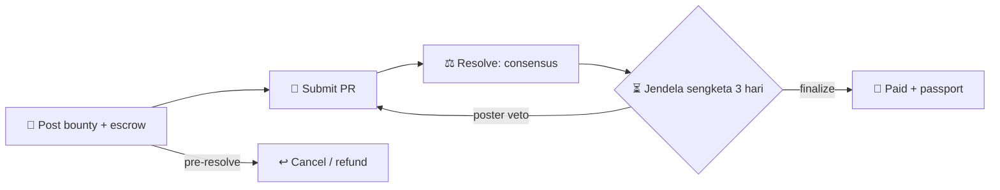

<p align="center">
  
</p>

<h1 align="center">Hallmark — Future of Work</h1>

<p align="center"><i>Automated bug bounties. Work verified by consensus, paid on outcome, with portable reputation.</i></p>

<p align="center">
  
  
  
  
</p>

<p align="center">
  <a href="https://github.com/weels007/hallmark"><b>GitHub</b></a> ·
  <a href="https://hallmark-ai.vercel.app/"><b>🚀 Live demo</b></a> ·
  <a href="https://explorer-studio.genlayer.com">Studio Explorer</a> ·
  <a href="./DEPLOYMENTS.md">Deployments</a> ·
  <a href="./frontend/how.html">Protocol</a>
</p>

---

## Status

| | |
|---|---|
| 💰 Live contract (studionet) | `0x595B17f0b0D28aBb0f9ab9818a9FE7dF7b3EF9Fd` |
| 📜 Source | [`contracts/future_work_bounty.py`](./contracts/future_work_bounty.py) |
| 🖥️ Frontend | [`frontend/`](./frontend) — landing · protocol · bounty workbench (Vite + `genlayer-js`) |
| 🧪 Adversarial | [`scripts/test-adversarial.ps1`](./scripts/test-adversarial.ps1) — **13/13 PASS** (dana + fixture; default 11 PASS + 2 SKIP) |
| ✅ E2E | post → submit PR #218 → resolve `medium`/50 → finalize `paid`, passport `contributor` |

## Alur



| # | Method | Siapa | Efek |
|---|--------|-------|------|
| 1 | `post_bounty(repo, title, description, low, med, high, crit, deadline)` | poster | Kunci escrow max (`crit`). `deadline` unix detik, `0` = tanpa batas |
| 2 | `submit_work(bounty_id, pr_number, notes)` | hunter | Tautkan PR GitHub. Poster diblokir self-hunt; `pr_number` harus positif-numerik; URL PR tersimpan |
| 3 | `resolve_submission(submission_id)` | siapa pun | Satu ronde konsensus (fetch PR + patch, cek `merged` + SHA, LLM tier) → status `pending` |
| 4 | `challenge_submission(submission_id, reason)` | poster | Veto + alasan tercatat → bounty dibuka lagi |
| 5 | `finalize_submission(submission_id)` | poster kapan pun, pihak lain pasca-jendela | Bayar hunter, refund sisa, bounty `paid`, passport naik tingkat |
| 6 | `cancel_bounty` · `refund_expired` · `sweep` | poster/owner · siapa pun · owner | Escape anti-locked; sweep hanya saldo di luar escrow |

Tier default (wei): `low=10` · `medium=50` · `high=150` · `critical=500`

## Consensus design

- Satu blok `run_nondet_unsafe`: fetch PR + patch → LLM grade → return terstruktur. Storage write & pesan dana selalu di luar blok.
- Validator bandingkan field keputusan saja (`merged`, `sha`, `severity`); reasoning advisory — tidak disimpan, tidak dipakai banding.
- Error prefix: `[EXPECTED]`/`[EXTERNAL]` harus sama persis · `[TRANSIENT]` sepakat bila sama-sama transient · `[LLM_ERROR]` selalu disagree → rotasi validator.

## Proven on-chain ⛓️

Studionet, 20 Sep 2026, wallet `cpe-deploy`/`cpe-v2`:

- 💸 Fund 2500 wei → post (genlayer-js) → submit PR #218 (merged, SHA `8c899cc…`) → resolve `MAJORITY_AGREE` 3/3: `medium`, payout 50 → finalize poster → **`paid`**, passport `contributor`/earned 50.
- 🧪 Adversarial 13/13: past-deadline · 6× unknown-record write · sweep-guard · list-empty · 2× view-guard · funded-post · unmerged-resolve (`[EXPECTED] PR not merged yet`, fixture PR open #11245).
- 🔍 Batch-2 manual: double-finalize · challenge-accepted · cancel-paid · submit-paid · refund-tanpa-deadline · cancel non-poster · self-hunt · bad-repo · owner-cancel + refund — semua menolak/berhasil sesuai desain.

<details>
<summary><b>Riwayat kontrak (arsip)</b></summary>

| Alamat | Status |
|--------|--------|
| `0x595B…EF9Fd` | ✅ aktif — view-guard + pr-hardening |
| `0x3cA0…A4cA` | arsip — view-guard, 13/13 + E2E medium/50 |
| `0x78b6…5c3Cd` | arsip — happy-path + sengketa 14 Sep 2026 |
| `0xda8F…4C5A5D` dkk | arsip eksperimen awal |

Detail penuh: [`DEPLOYMENTS.md`](./DEPLOYMENTS.md).

</details>

## Frontend

```bash
cd frontend && npm install && npm run dev   # dev di :5173
npm run build                               # output dist/
```

- `/` landing · `/how.html` protokol + fund-safety · `/app.html` ledger, post/submit/resolve, passport, my-submissions.
- Tiap write menunggu receipt `FINALIZED` per hash; panel hasil baca-balik `get_submission` + `get_bounty` dari chain + deep-link `explorer-studio.genlayer.com/tx/{hash}`.
- Deploy (Vercel): import repo → setting default — `vercel.json` sudah mengatur build `frontend/` → `frontend/dist`.

```
.
├── contracts/future_work_bounty.py   # intelligent contract
├── frontend/                         # Vite app (index/how/app + styles + genlayer-js)
├── scripts/test-adversarial.ps1      # adversarial suite
├── DEPLOYMENTS.md                    # deployment log + arsip
└── vercel.json                       # build config
```

## Batasan jujur

- 🔌 CLI tidak mendukung `--value`: escrow lewat pre-fund `account send` (JS SDK mendukung payable langsung).
- 🧾 PR tanpa `merge_commit_sha` (sangat tua) → resolve MENOLAK (`[EXPECTED] No merge SHA`) — payout tanpa binding SHA tidak dapat dipertahankan.
- ⚖️ Sengketa asimetris by design: hanya poster bisa veto; hunter resubmit pasca-veto. Veto membuka ulang bounty (bukan merampas dana); finalisasi permissionless pasca-jendela menyeimbangkan.
- 🖥️ Quirk CLI: membuang arg string kosong dan memaksa `' '`→`0` — guard kontrak menutup celahnya; `genlayer call` tak men-decode UserError view (guard terbukti via payload base64 di receipt).
